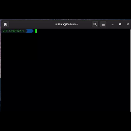

<h1>Useful tools for linux</h1>

So, i hope you are fine, that's my first time writing in other language for an project that's beggining, i'am do this that way beacuse i know the most content for linux is written in english.

I won't review this text on translate or another thing, than can be several mistakes in my writing, previously i'm sorry i hope these scripts help you in something

I still don't know how programs in linux are configured, but i'm learing many things in my new job, however i started meaning how can i solve some problems and first problem occurred with me it was to list failed services on linux. It's oblivious we could use
something how "systemctl status service_name.service" but i belive that quick view as a whole help a lot.

I'll split the scripts with installer them and when we'll have a good amount, we'll bring everything together in only one installer.

<h1>List Service</h1>
<h3>To list all failed services: </h3>

    

`Teste`

